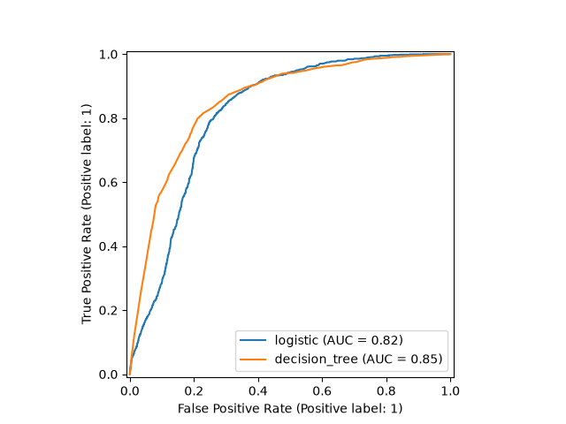
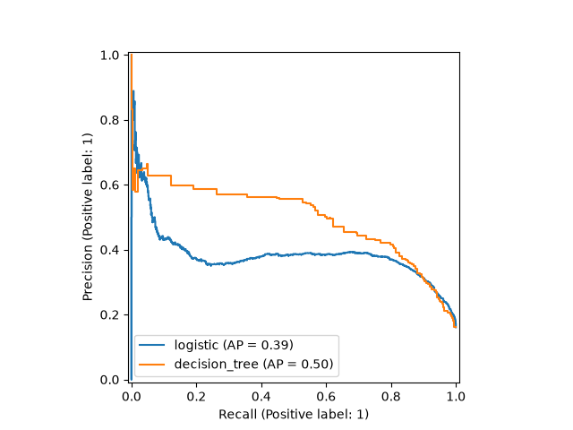
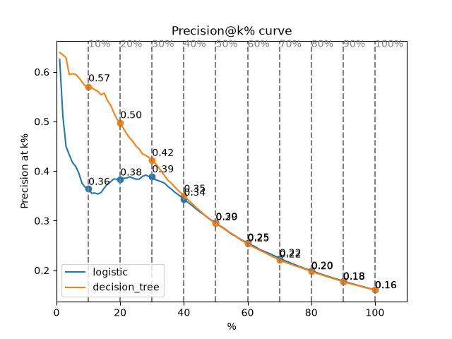
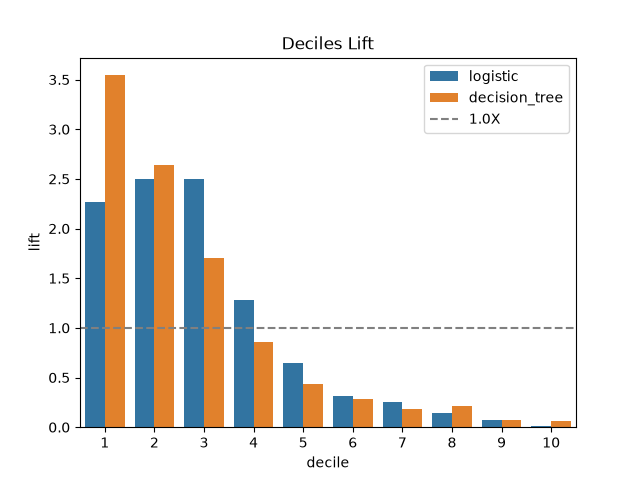
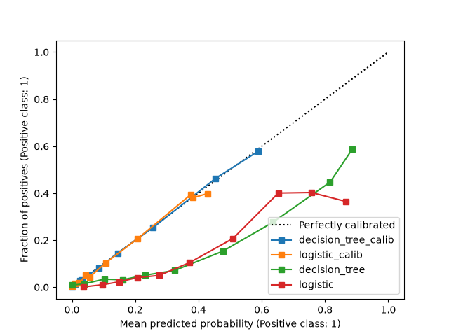
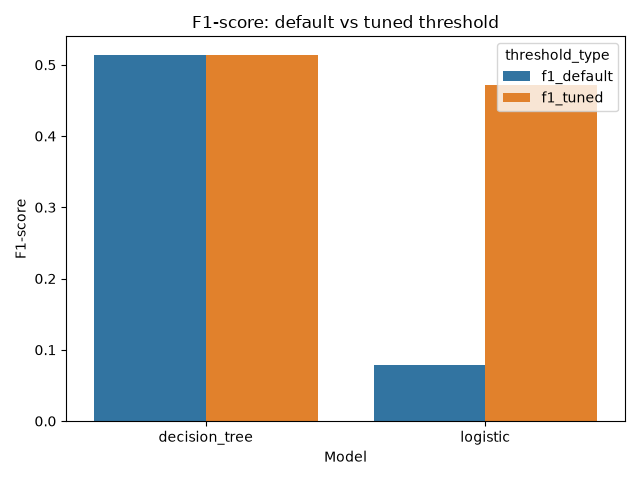
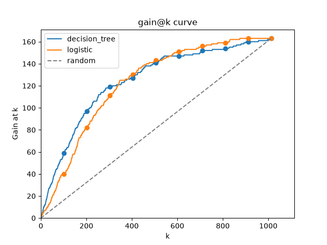
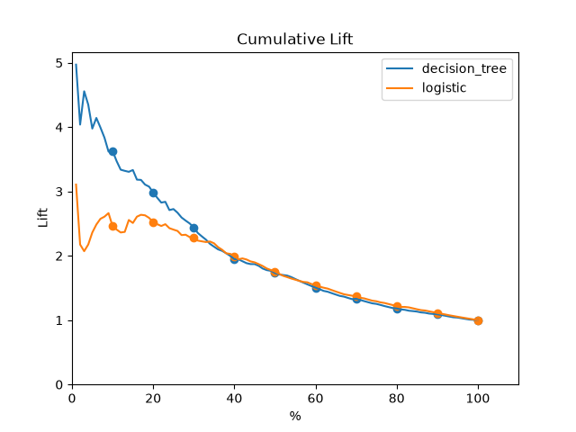
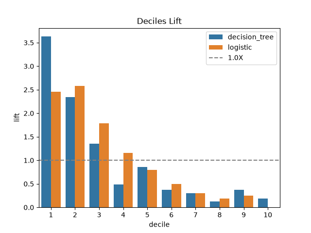

# bank-churn-prediction
Churn prediction with a [Kaggle dataset](https://www.kaggle.com/datasets/sakshigoyal7/credit-card-customers) using credit card data. Focused more on the process rather than on the results. It features the following steps: Data viz, Hiperparameter tunning, Model calibration and Threshold tunning.

The objective is to have a model that estimates churn probabilities by customer.

See also [the Kaggle notebook version of this project](https://www.kaggle.com/code/pendulun/bank-churn-prediction-model-calib-thresh-tunning).

# Requirements

This project requires Python >=3.13. It is recomended to use `uv` to install all dependencies.

# Steps

## 1. Install dependencies
At the projects root folder and with `uv` installed, run: `uv sync`. This will create a virtual environment inside the project with all the dependencies.

## 2. Downloading data

To download the dataset, run: `uv run python src/data/download_data.py`. It will download the data at `./data/raw/BankChurners.csv`

## 3. Preprocessing

The preprocessing is just a binarization of the target y column with integer values as it is originally a string column. To preprocess the raw data run `uv run python src/preprocessing/preprocess.py`. It will save the new data at `./data/preprocessed/data.csv`

## 4. Splitting data

This step splits data into 4 disjoint sets: Training, Calibration, Threshold Tunning and Testing sets. Each one is responsible for:

1. Training set (72%): Hiperparameter tunning with cross-validation to evaluate models configs.
2. Calibration set (9%): Used to transform models `predict_proba` outputs into reliable probabilities of churning.
3. Threshold tunninng set (9%): Used to optimize the threshold that decides whether or not someone will churn based on a (business) metric.
4. Testing set (10%): Used to evaluate the models generalization capabilities.

To split the preprocessed data into these 4 sets, run: `uv run python src/spliting_data/split_data.py`. All data splits will be saved at `./data/splitted/`.

## 5. Data Viz

Now, we plot some features against the target. To do so, run: `uv run python src/data_viz/plots.py`. All plots will be created at `./data/assets/data_viz`

### 5.1 Main findings


We see that the features with the most negative correlations do make sense: If someone have more transactions in a giving time, it is fair to say that this person is less likely churn.

Features with significant positive correlation with churn include the total months inactive (which also make sense and probably is correlated with transactions) and contacts count. I suppose that the bank, already having detected that the person might churn, increased the contacts with them. So I don't think this would be a good feature to predict churn, as it probably comes after the person would already be going to churn. I want to estimate the churn probability before the bank starts contacting that person.


This is a very interesting plot that shows that people who have churned have less transactions.


The plot above shows that people who have more than ~50 transactions are less likely to churn. Also, people with less than ~20 transactions are more likely to churn. Between 20-50 transactions is kind of a grey area.

See more plots at the Kaggle notebook link in the introduction or at the `./data/assets/data_viz/` folder.

## 6. Fitting models

This step evaluates two models: Logistic Regression and Decision Tree Classifier. These are simple models but, as writen in the introduction, I wanted to focus on the process rather than on the details. On a real context, I'd test Random Forests, KNNClassifiers and more features (I'm only using 2 features).

To execute a GridSearchCV over hiperparameters for those 2 models, run: `uv run python src/model/fit_models.py`. This will produce the best estimators for each family in `./models/base/` and evaluation plots at `./data/assets/model_eval/`.

### 6.1 Main plots





From the plots above, we see that, using OOF predictions, the decision tree classifier has a greater ROC-AUC (0.85 vs 0.82) and AP (0.50 vs 0.39). The first one means that it is better in ranking positive instances above negative ones. The second on means that it is able to maintain a better trade-off between precision and recall across different classification thresholds, resulting in a higher average precision.



We see that the Decision tree model is way better than the logistic regression model up to 30% of the ranked instances. Starting from the 30%, both models achieve the same precision@k



Given the plot above, we see that the decision model has a greater lift than the logistic regression model up until about 30% of the ranking produced. The Decision Tree model is able to achieve ~3.5X lift at the first 30% of the ranking it produces, which means that it is about 3.5 times better than the overall 16% of positive rate on the training data.

See more plots at the Kaggle notebook link in the introduction or at the `./data/assets/model_eval/` folder.

## 7. Calibrating models

This step makes it so that the probabilities given by the model more accurately represents the mean probability of the target to be positive. If we don't do this, an output of 0.4 from a `predict_proba` call doesn't really mean that 40% of similar data are going to churn.

To calibrate the fitted models on the previous step, run: `uv run python src/calibration/calibrate_models.py`. The calibrated models will be saved at `./models/calib/` and the calibration plot at `./data/assets/calibration/`.



We see from the plot above that the mean probabilities given by the uncalibrated decision tree makes a monotonic function whereas the uncalibrated logistic function does not. This makes it so that the decision tree probabilities are more reliable. Nonetheless, both curves are far from the perfectly calibrated curve. While the real fraction of positives doesn't go past 0.5, the models probabilities achieve near 1 values.

After calibrating, we see now that the decision tree model nearly matches the 'Perfectly calibrated' dashed line. The logistic model also has a better curve. Both curves stay below the (0.6, 0.6) point in the plot. This is because we are dealing with a higly imbalanced dataset with only about 16% of positive instances. In this case, if we predict a probability of 60% of churn, this is more than 3.5 times the base churn rate.

## 8. Threshold tunning

We are trying to predict who will churn. Okay, that's about done. We do have a calibrated model that gives a probability that someone will churn. But a probability alone does not tell us what action to take.

Suppose our model predicts that a customer has a 40% probability of churning. Should we classify this customer as likely to churn? What about a customer with a 20% probability? Or 60%?

To turn probabilities into binary predictions, we need a decision threshold. The default value of 0.5 is not necessarily the threshold that gives the best performance for our objective. Since we want to balance precision and recall, we can tune the threshold to maximize the F1-score.

To tunne the decision threshold for the calibrated models, run: `uv run python src/thresh_tunning/thresh_tune.py`. It will print out the best values found for each model and save the tunned models into `./models/thresh_tuned/`. As the models classes are `TunedThresholdClassifierCV`, the instances saved already have the best threshold saved along the base (calibrated) model.

The best thresholds found by model are:

```
decision_tree: best threshold = 0.2906
logistic: best threshold = 0.1515
```

These values are way lower than the 0.5 default.

## 9. Run on test data

Finally, let's apply our models to the testing data. We'll also compare how the threshold tunned models compare against those who only use the 0.5 threshold. To do this, run: `uv run python src/testing/test.py`. It will load the calibrated and threshold tunned models and evaluate them on the testing set. All plots will be saved at `./data/assets/test/`



We see that the logistic model has a greater benefit from threshold tuning on the testing data. We also see that the decision tree model achieves a better f1-score.

Lets see how the gain and lift plots compare between the threshold tunned models.





From the plots above, we see that the decision tree model still has a greater cumulative lift than the logistic model up for the top 30% instances with the greatest probability of churning.

As this is the same result achieved during training, it means that the model has a good generalizability. Also, the ranking it produced could be helpful with targeting for the bank.