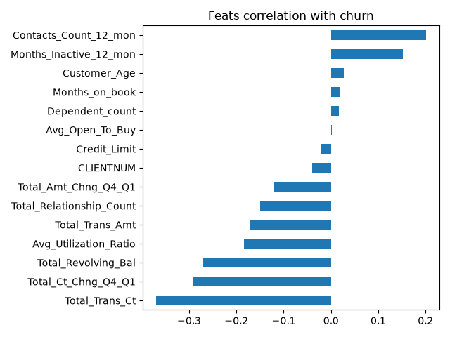
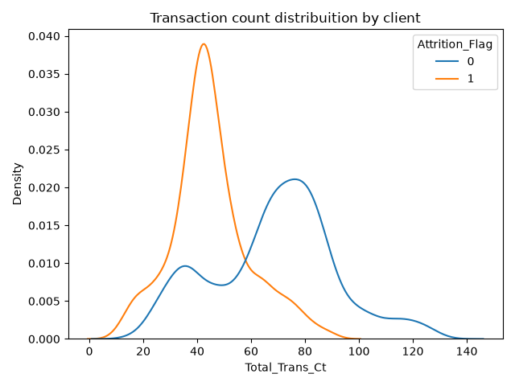
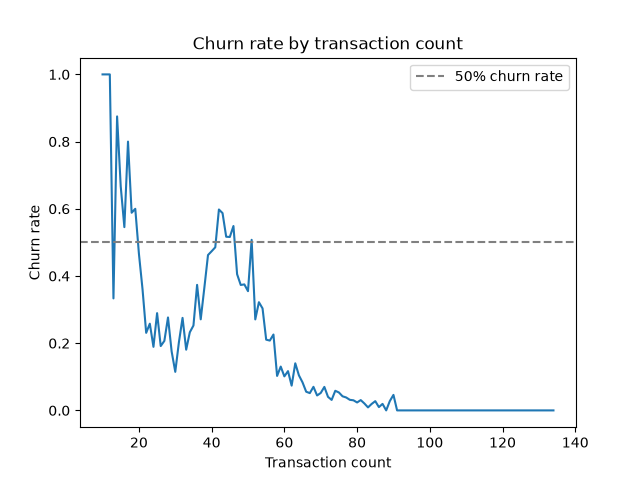

# bank-churn-prediction
Churn prediction with a [Kaggle dataset](https://www.kaggle.com/datasets/sakshigoyal7/credit-card-customers) using credit card data. Focused more on the process rather than on the results. It features the following steps: Data viz, Hiperparameter tunning, Model calibration and Threshold tunning.

The objective is to have a model that estimates churn probabilities by customer.

See also [the Kaggle notebook version of this project](https://www.kaggle.com/code/pendulun/bank-churn-prediction-model-calib-thresh-tunning).

# Requirements

This project requires Python >=3.13. It is recomended to use `uv` to install all dependencies.

# Steps

## 1. Install dependencies
At the projects root folder and with `uv` installed, run: `uv sync`. This will create a virtual environment inside the project with all the dependencies.

## 2. Downloading data

To download the dataset, run: `uv run python src/data/download_data.py`. It will download the data at `./data/raw/BankChurners.csv`

## 3. Preprocessing

The preprocessing is just a binarization of the target y column with integer values as it is originally a string column. To preprocess the raw data run `uv run python src/preprocessing/preprocess.py`. It will save the new data at `./data/preprocessed/data.csv`

## 4. Splitting data

This step splits data into 4 disjoint sets: Training, Calibration, Threshold Tunning and Testing sets. Each one is responsible for:

1. Training set (72%): Hiperparameter tunning with cross-validation to evaluate models configs.
2. Calibration set (9%): Used to transform models `predict_proba` outputs into reliable probabilities of churning.
3. Threshold tunninng set (9%): Used to optimize the threshold that decides whether or not someone will churn based on a (business) metric.
4. Testing set (10%): Used to evaluate the models generalization capabilities.

To split the preprocessed data into these 4 sets, run: `uv run python src/spliting_data/split_data.py`. All data splits will be saved at `./data/splitted/`.

## 5. Data Viz

Now, we plot some features against the target. To do so, run: `uv run python src/data_viz/plots.py`. All plots will be created at `./data/assets/data_viz`

### 5.1 Main findings

We see that the features with the most negative correlations do make sense: If someone have more transactions in a giving time, it is fair to say that this person is less likely churn.

Features with significant positive correlation with churn include the total months inactive (which also make sense and probably is correlated with transactions) and contacts count. I suppose that the bank, already having detected that the person might churn, increased the contacts with them. So I don't think this would be a good feature to predict churn, as it probably comes after the person would already be going to churn. I want to estimate the churn probability before the bank starts contacting that person.

This is a very interesting plot that shows that people who have churned have less transactions.

The plot above shows that people who have more than ~50 transactions are less likely to churn. Also, people with less than ~20 transactions are more likely to churn. Between 20-50 transactions is kind of a grey area.

See more plots at the Kaggle notebook link in the introduction or at the `./data/assets/data_viz/` folder.